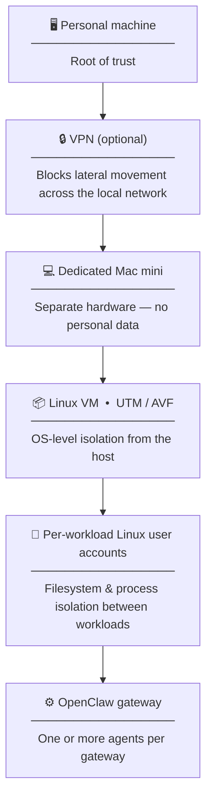

# juso

**重層** (*jūsō*) — multilayered, stratified.

A defense-in-depth platform for running OpenClaw agents on personal hardware.

OpenClaw agents execute tools, browse the web, and interact with external services on your behalf. Running them directly on a personal machine means a compromised agent has direct access to your files, credentials, and network. juso wraps OpenClaw in independent isolation layers (network, hypervisor, OS) so that a compromised agent faces a chain of distinct barriers rather than a single point of failure.

juso is the platform layer: isolation, scripts, and validation. Your agents live in separate repos and deploy on top, free to use the full range of OpenClaw capabilities.

---

## Architecture

The diagram reflects my personal setup: Mac mini as the dedicated agent host, MacBook as the operator machine, UTM with Apple Virtualization Framework as the hypervisor, Ubuntu 24 LTS ARM64 as the VM OS. Some of the repo's naming follows from this. The structure (dedicated host, VM isolation, per-workload Linux users, UFW (Uncomplicated Firewall)) applies to other hardware and hypervisors; substitute your own where the guides reference Mac mini or MacBook.

The layers are independent, each enforcing its boundary through different mechanisms, so a failure in one doesn't compromise the others.

The VM is the primary isolation boundary. A hypervisor-level boundary means an attacker must defeat both the agent sandbox and the hypervisor before reaching host-level access. The tradeoff is additional setup complexity for a stronger isolation guarantee.

Inside the VM, each workload runs as a dedicated Linux user account. The OS enforces filesystem and process separation between workloads regardless of what OpenClaw does or doesn't do, so a mis-configured gateway doesn't affect this boundary. Each workload gets a full OpenClaw gateway rather than a profile, giving it isolated state, credentials, and tool policies.

Network access is controlled by UFW at the kernel level. All workloads are blocked from private LAN address ranges by default. Workloads are provisioned with explicit internet access (`--internet=open`) or none (`--internet=none`). VPN is an optional additional layer for internet-enabled workloads, routing agent traffic through a WireGuard tunnel with a kill switch if the connection drops.

---

## Approach

juso includes a validation agent that actively probes the isolation layers, attempting LAN connections, cross-workload file access, and metadata endpoint requests. A mis-ordered UFW rule passes all traffic silently; only a live probe tells you whether containment actually holds. The audit produces a PASS/FAIL result per check and is meant to be re-run after any configuration change, not just at initial setup.

The reference implementation uses Ollama running on the Mac mini host, outside the VM. Agents reach it over the virtual network interface rather than the internet, which keeps model API credentials out of the agent environment and inference on local hardware. A compromised agent also can't observe what other agents are asking the model. Cloud APIs work equally well; the tradeoffs are different (API keys live in the agent environment, inference data leaves local hardware) but juso's isolation applies either way.

The threat model is explicit: to reach your personal systems from a compromised agent, an attacker needs to compromise the agent process, escape Linux user isolation within the VM, escape the VM itself, compromise the Mac mini host, and defeat network isolation. Each step requires a different class of exploit. The full sequence is in `design/architecture.md`.

juso focuses on containment rather than detection, which means a compromised agent operating within its permitted boundaries may not be visible. Web content fetched by agents reaches the model without a classifier layer; OpenClaw marks external content structurally but that doesn't prevent prompt injection through an authorized fetch. And if your personal machine is independently compromised, juso's isolation doesn't help.

---

## Setup

Setup is detailed but fully scripted. Follow the guides in order:

1. [Mac mini host setup](guides/mini-host-setup.md)
2. [VM setup](guides/mini-vm-setup.md)
3. [MacBook setup](guides/macbook-setup.md)
4. [OpenClaw setup](guides/openclaw-setup.md)
5. [Provisioning a workload](guides/provisioning.md)

After setup, run the validation agent to confirm the isolation layers are holding. Re-run it after any infrastructure change.

| Path | Contents |
|------|----------|
| `design/` | Requirements and architecture documentation |
| `guides/` | Step-by-step setup and operational procedures |
| `scripts/` | Infrastructure scripts for the Mac mini host, VM, and MacBook |
| `validation/` | Validation agent and audit framework |
