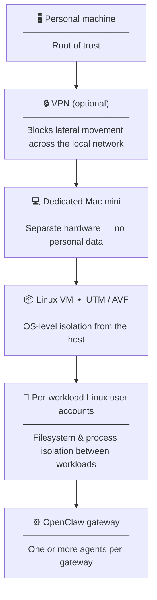

# juso

**重層** (*jūsō*) — multilayered, stratified.

**juso** is a defense-in-depth system for running OpenClaw agents on personal hardware. It provides layered isolation for autonomous agents operating on a local machine, reducing the risk of data exfiltration or system compromise if an agent behaves unexpectedly or is malicious.

OpenClaw agents execute tools, browse the web, and interact with external services on your behalf. Running them directly on a personal machine means a compromised agent potentially has access to your files, credentials, and network. juso addresses this by wrapping OpenClaw in independent isolation layers (network, hypervisor, OS) so that a compromised agent faces a chain of distinct barriers rather than a single point of failure. The goal is not to rely on any single boundary, but to ensure that failure of one layer does not compromise the system as a whole.

juso provides the isolation, provisioning, and validation infrastructure. Workload repos deploy agents on top, composing juso's primitives to build their own agent/ops script tiers and operational tooling.

---

## Architecture

The diagram reflects the reference implementation: Mac mini as the dedicated agent host, MacBook as the operator machine, UTM with Apple Virtualization Framework as the hypervisor, Ubuntu 24 LTS ARM64 as the VM OS. The structure (dedicated host, VM isolation, per-workload Linux users, UFW) applies to other hardware and hypervisors.

```mermaid
flowchart TD
    A["🖥️ Personal machine\n─────────────────\nRoot of trust"]
    B["🔒 VPN (optional)\n─────────────────\nBlocks lateral movement across the local network"]
    C["💻 Dedicated Mac mini\n─────────────────\nSeparate hardware — no personal data"]
    D["📦 Linux VM  •  UTM / AVF\n─────────────────\nOS-level isolation from the host"]
    E["👤 Per-workload Linux user accounts\n─────────────────\nFilesystem & process isolation between workloads"]
    F["⚙️ OpenClaw gateway\n─────────────────\nOne or more agents per gateway"]

    A --> B --> C --> D --> E --> F
```

The layers are independent, each enforcing its boundary through different mechanisms, so a failure in one doesn't compromise the others.

The VM is the primary isolation boundary. A hypervisor-level boundary means an attacker must defeat both the agent sandbox and the hypervisor before reaching host-level access.

Inside the VM, each workload runs as a dedicated Linux user account. The OS enforces filesystem and process separation between workloads regardless of what OpenClaw does or doesn't do. Each workload gets a full OpenClaw gateway rather than a profile, giving it isolated state, credentials, and tool policies.

Within each workload, scripts are split into kernel-ACL-enforced tiers: `agent/` scripts are readable and executable by the workload user; `ops/` scripts are root-only and inaccessible to the workload user entirely. The workload user also cannot write its own `openclaw.json` or tool-exec config — those are owned by root. This means a compromised agent cannot read privileged scripts, alter its own configuration, or self-escalate. Operator access to `ops/` scripts goes through `juso-ops-exec`, a sudoers-gated gateway. The ACL is verified both statically (`juso-audit-acl`) and behaviorally (negative checks run as the workload user in `audit.sh`).

Network access is controlled by UFW at the kernel level. All workloads are blocked from private LAN address ranges by default. Workloads are provisioned with explicit internet access (`--internet=open`) or none (`--internet=none`). VPN is an optional additional layer for internet-enabled workloads.

---

## Operating model

juso is designed for agent-first operation. There are two distinct agent roles:

**Agent operator** — an AI assistant (Claude, in the reference implementation) running on the operator's personal machine. It manages the platform day-to-day via juso's Mac-side primitives: pushing scripts, starting and stopping workloads, deploying agent files, monitoring. It operates outside the VM and has no workload-level privileges inside it.

**Workload agents** — OpenClaw agents running inside the VM as unprivileged Linux users. These are the agents being contained. They execute tools, browse the web, and interact with external services — and are the threat model juso is designed around.

The isolation guarantees do not depend on either agent behaving correctly; they are enforced by the OS and hypervisor regardless.

Human involvement is required for initial platform setup and infrequent operations: provisioning or destroying workloads, OpenClaw upgrades, security configuration changes, and validation after infrastructure changes. The setup guides assume a human operator for these steps. This is a practical constraint of the current implementation, not an architectural requirement.

---

## Approach

juso includes a validation agent that actively probes the isolation layers, attempting LAN connections, cross-workload file access, privilege escalation, and metadata endpoint requests. The audit produces a PASS/FAIL result per check and is meant to be re-run after any configuration change, not just at initial setup.

The reference implementation uses Ollama running on the Mac mini host, outside the VM. Agents reach it over the virtual network interface rather than the internet, which keeps model API credentials out of the agent environment and inference on local hardware. Cloud APIs work equally well; the tradeoffs are different but juso's isolation applies either way.

To reach your personal systems from a compromised agent, an attacker needs to compromise the agent process, escape Linux user isolation within the VM, escape the VM itself, compromise the Mac mini host, and defeat network isolation. Each step requires a different class of exploit. The full sequence is in `design/architecture.md`.

juso focuses on containment rather than detection — a compromised agent operating within its permitted boundaries may not be visible. Web content fetched by agents reaches the model without a classifier layer; OpenClaw marks external content structurally but that doesn't prevent prompt injection through an authorized fetch.

---

## Setup

Initial platform setup follows the guides in order:

1. [Mac mini host setup](guides/mini-host-setup.md)
2. [VM setup](guides/mini-vm-setup.md)
3. [MacBook setup](guides/macbook-setup.md)
4. [OpenClaw setup](guides/openclaw-setup.md)
5. [Provisioning a workload](guides/provisioning.md)
6. [Validation](guides/validation.md)

Day-to-day operations — starting and stopping workloads, deploying scripts, maintaining the platform — are covered in [operations.md](guides/operations.md). Re-run validation after any infrastructure change.

| Path            | Contents                                                      |
| --------------- | ------------------------------------------------------------- |
| `design/`       | Requirements and architecture documentation                   |
| `guides/`       | Setup, provisioning, operations, and validation procedures    |
| `scripts/`      | Infrastructure scripts for the Mac mini host, VM, and MacBook |
| `validation/`   | Validation agent and audit framework                          |
